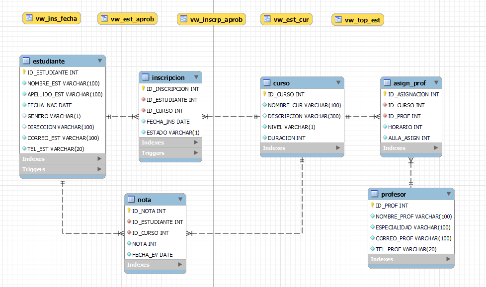

# 
Entrega de proyecto final

@Matias Fredes

@53180-sql

@Carla Palermo Palermo @Santiago Angel Gonzalez Martin

@Anderson Michel Torres

---

### **Consignas:**
- La base de datos debe contener al menos:
    * ~ 15 tablas, entre las cuales debe haber al menos 1 tabla de hechos,  2 tablas transaccionales.
    * ~ 5 vistas.
    * ~ 2 stored procedure.
    * ~ 2  trigger.
    * ~ 2 funciones
    
- El documento debe contener:
    - Introducción
    - Objetivo
    - Situación problemática
    - Modelo de negocio
    - Diagrama de entidad relació
    - Listado de tablas con descripción de estructura (columna,descripción, tipo de datos, tipo de clave)
    - Scripts de creación de cada objeto de la base de datos
    - Scripts de inserción de datos
    - Informes generados en base a la información de la base
    - Herramientas y tecnologías usadas

---

## Tematica del proyecto

El proyecto consiste en el desarrollo de un Sistema de Gestión Académica para la Universidad Tecnológica Nacional (UTN) que permita administrar y organizar de manera eficiente los datos de estudiantes, cursos, inscripciones, notas y profesores. Este sistema está diseñado para mejorar la gestión de información académica, facilitar la inscripción de estudiantes a cursos, y proporcionar herramientas analíticas para evaluar el rendimiento estudiantil y la carga académica. 

## Modelo de negocio

El Sistema de Gestión Académica para la Universidad Tecnológica Nacional (UTN) se presenta como una solución que ofrece una propuesta de valor única al automatizar y optimizar la administración académica, permitiendo una gestión centralizada y segura de la información. De obtener resultados positivos, este sistema estará dirigido a universidades y centros educativos que buscan mejorar la eficiencia administrativa y ofrecer herramientas analíticas avanzadas.

## Diagrama entidad relacion (DER)

## Listado de tablas y descripcion

## Tabla ESTUDIANTES: Almacena la información de todos los alumnos de la facultad

| Campo         | Campo (completo)        | Tipo de dato | Longitud | Tipo de Clave | Not Null | Auto Incremental | Default | Clave Index | Clave Unique | Descripción                     |
|---------------|-------------------------|--------------|----------|---------------|----------|-------------------|---------|-------------|--------------|---------------------------------|
| ID_ESTUDIANTE | ID_DEL_ESTUDIANTE       | INT          |          | Primaria      | X        | X                 |         | X           | X            | Identificador del estudiante    |
| NOMBRE_EST    | NOMBRE_DEL_ESTUDIANTE   | VARCHAR      | 100      |               | X        |                   |         |             |              | Nombre del estudiante           |
| APELLIDO_EST  | APELLIDO_DEL_ESTUDIANTE | VARCHAR      | 100      |               | X        |                   |         |             |              | Apellido del estudiante         |
| FECHA_NAC     | FECHA_DE_NACIMIENTO     | DATE         |          |               | X        |                   |         |             |              | Fecha de nacimiento             |
| GENERO        | GENERO                  | VARCHAR      | 1        |               |          |                   |         |             |              | Género del estudiante (M/F)     |
| DIRECCION     | DIRECCION_DEL_DOMICILIO | VARCHAR      | 100      |               |          |                   |         |             |              | Dirección del estudiante        |
| CORREO_EST    | CORREO_DEL_ESTUDIANTE   | VARCHAR      | 100      |               | X        |                   |         |             | X            | Correo electrónico              |
| TEL_EST       | TELEFONO_DEL_ESTUDIANTE | VARCHAR      | 20       |               | X        |                   |         |             | X            | Número de teléfono              |

## Tabla CURSO: Almacena los cursos disponibles en la facultad

| Campo       | Campo (completo)        | Tipo de dato | Longitud | Tipo de Clave | Not Null | Auto Incremental | Default | Clave Index | Clave Unique | Descripción                |
|-------------|-------------------------|--------------|----------|---------------|----------|-------------------|---------|-------------|--------------|----------------------------|
| ID_CURSO    | ID_DEL_CURSO            | INT          |          | Primaria      | X        | X                 |         | X           | X            | Identificador del curso    |
| NOMBRE_CUR  | NOMBRE_DEL_CURSO        | VARCHAR      | 100      |               | X        |                   |         |             |              | Nombre del curso           |
| DESCRIPCION | DESCRIPCION_DEL_CURSO   | VARCHAR      | 300      |               |          |                   |         |             |              | Descripción del curso      |
| NIVEL       | NIVEL_DEL_CURSO         | VARCHAR      | 1        |               | X        |                   |         |             |              | Nivel del curso (F/I/D)    |
| DURACION    | DURACION_DEL_CURSO      | INT          |          |               | X        |                   |         |             |              | Duración del curso (en horas) |

## Tabla INSCRIPCION: Almacena todas las inscripciones en sus estados correspondientes

| Campo          | Campo (completo)         | Tipo de dato | Longitud | Tipo de Clave | Not Null | Auto Incremental | Default | Clave Index | Clave Unique | Descripción                    |
|----------------|--------------------------|--------------|----------|---------------|----------|-------------------|---------|-------------|--------------|--------------------------------|
| ID_INSCRIPCION | ID_DE_LA_INSCRIPCION     | INT          |          | Primaria      | X        | X                 |         | X           | X            | Identificador de la inscripción |
| ID_ESTUDIANTE  | ID_DEL_ESTUDIANTE        | INT          |          | Foránea       | X        |                   |         |             |              | Identificador del estudiante   |
| ID_CURSO       | ID_DEL_CURSO             | INT          |          | Foránea       | X        |                   |         |             |              | Identificador del curso        |
| FECHA_INS      | FECHA_DE_INSCRIPCION     | DATE         |          |               | X        |                   |         |             |              | Fecha de inscripción           |
| ESTADO         | ESTADO_DE_LA_INSCRIPCION | VARCHAR      | 1        |               | X        |                   |         |             |              | Estado de la inscripción (P/C/R) |

## Tabla NOTA: Almacena las notas obtenidas por los estudiantes en los distintos cursos

| Campo          | Campo (completo)    | Tipo de dato | Longitud | Tipo de Clave | Not Null | Auto Incremental | Default | Clave Index | Clave Unique | Descripción                     |
|----------------|---------------------|--------------|----------|---------------|----------|-------------------|---------|-------------|--------------|---------------------------------|
| ID_NOTA        | ID_DE_LA_NOTA       | INT          |          | Primaria      | X        | X                 |         | X           | X            | Identificador de la nota        |
| ID_ESTUDIANTE  | ID_DEL_ESTUDIANTE   | INT          |          | Foránea       | X        |                   |         |             |              | Identificador del estudiante    |
| ID_CURSO       | ID_DEL_CURSO        | INT          |          | Foránea       | X        |                   |         |             |              | Identificador del curso         |
| NOTA           | NOTA_DE_EXAMEN      | INT          |          |               | X        |                   |         |             |              | Nota obtenida                   |
| FECHA_EV       | FECHA_DE_EVALUACION | DATE         |          |               | X        |                   |         |             |              | Fecha de evaluación             |

## Tabla PROFESOR: Almacena la información de todos los profesores de la facultad

| Campo          | Campo (completo)            | Tipo de dato | Longitud | Tipo de Clave | Not Null | Auto Incremental | Default | Clave Index | Clave Unique | Descripción                    |
|----------------|-----------------------------|--------------|----------|---------------|----------|-------------------|---------|-------------|--------------|--------------------------------|
| ID_PROF        | ID_DEL_PROFESOR             | INT          |          | Primaria      | X        | X                 |         | X           | X            | Identificador del profesor     |
| NOMBRE_PROF    | NOMBRE_DEL_PROFESOR         | VARCHAR      | 100      |               | X        |                   |         |             |              | Nombre del profesor            |
| ESPECIALIDAD   | ESPECIALIDAD_DEL_PROFESOR   | VARCHAR      | 100      |               | X        |                   |         |             |              | Especialidad del profesor      |
| CORREO_PROF    | CORREO_DEL_PROFESOR         | VARCHAR      | 100      |               | X        |                   |         |             | X            | Correo electrónico             |
| TEL_PROF       | TELEFONO_DEL_PROFESOR       | VARCHAR      | 20       |               | X        |                   |         |             | X            | Número de teléfono             |

## Tabla ASIGN_PROF: Almacena las asignaciones de profesores a cursos de la facultad

| Campo          | Campo (completo)           | Tipo de dato | Longitud | Tipo de Clave | Not Null | Auto Incremental | Default | Clave Index | Clave Unique | Descripción                      |
|----------------|----------------------------|--------------|----------|---------------|----------|-------------------|---------|-------------|--------------|----------------------------------|
| ID_ASIGNACION  | ID_DE_LA_ASIGNACION        | INT          |          | Primaria      | X        | X                 |         | X           | X            | Identificador de la asignación   |
| ID_CURSO       | ID_DEL_CURSO_ASIGNADO      | INT          |          | Foránea       | X        |                   |         |             |              | Identificador del curso          |
| ID_PROF        | ID_DEL_PROFESOR_ASIGNADO   | INT          |          | Foránea       | X        |                   |         |             |              | Identificador del profesor       |
| HORARIO        | HORARIO_DE_LA_ASIGNACION   | INT          |          |               | X        |                   |         |             |              | Horario de la asignación         |
| AULA_ASIGN     | AULA_ASIGNADA              | INT          |          |               | X        |                   |         |             |              | Aula asignada para la clase      |

## Estructura de datos

- [Estructura principal](https://github.com/matfredes/Facultad_Fredes/blob/main/structure/database_structure.sql)
- [Inserción de datos](https://github.com/matfredes/Facultad_Fredes/blob/main/structure/population.sql)
- [Vistas](https://github.com/matfredes/Facultad_Fredes/blob/main/objects/views.sql)
- [Funciones](https://github.com/matfredes/Facultad_Fredes/blob/main/objects/functions.sql)
- [Stored Procedures](https://github.com/matfredes/Facultad_Fredes/blob/main/objects/store_procedures.sql)
- [Triggers](https://github.com/matfredes/Facultad_Fredes/blob/main/objects/triggers.sql)
- [Roles](https://github.com/matfredes/Facultad_Fredes/blob/main/objects/roles_users.sql)
- [Backup](https://github.com/matfredes/Facultad_Fredes/blob/main/backups/backup_facultad.sql)

## Herramientas y tecnologias usadas

**Plataforma CoderHouse**
- Mediante el curso de SQL de CoderHouse, aprendimos los conceptos fundamentales para el desarrollo de una base de datos funcional

**MySql**
- Es el sistema de gestión de bases de datos utilizada para la creación y diseño de nuestro proyecto

**GitHub**
- Plataforma utilizada para la creación de repositorio que almacena la estructura de la base de datos y permite ejecutarla

## Como levantar el proyecto en CodeSpaces GitHub
* env: Archivo con contraseñas y data secretas
* Makefile: Abstracción de creacción del proyecto
* docker-compose.yml: Permite generar las bases de datos en forma de contenedores

#### Pasos para arrancar el proyecto

* En la terminal de linux escribir :
    - `make` _si te da un error de que no conexion al socket, volver al correr el comando `make`_
    - `make clean-db` limpiar la base de datos
    - `make test-db` para mirar los datos de cada tabla
    - `make backup-db` para realizar un backup de mi base de datos
    - `make access-db` para acceder a la base de datos
